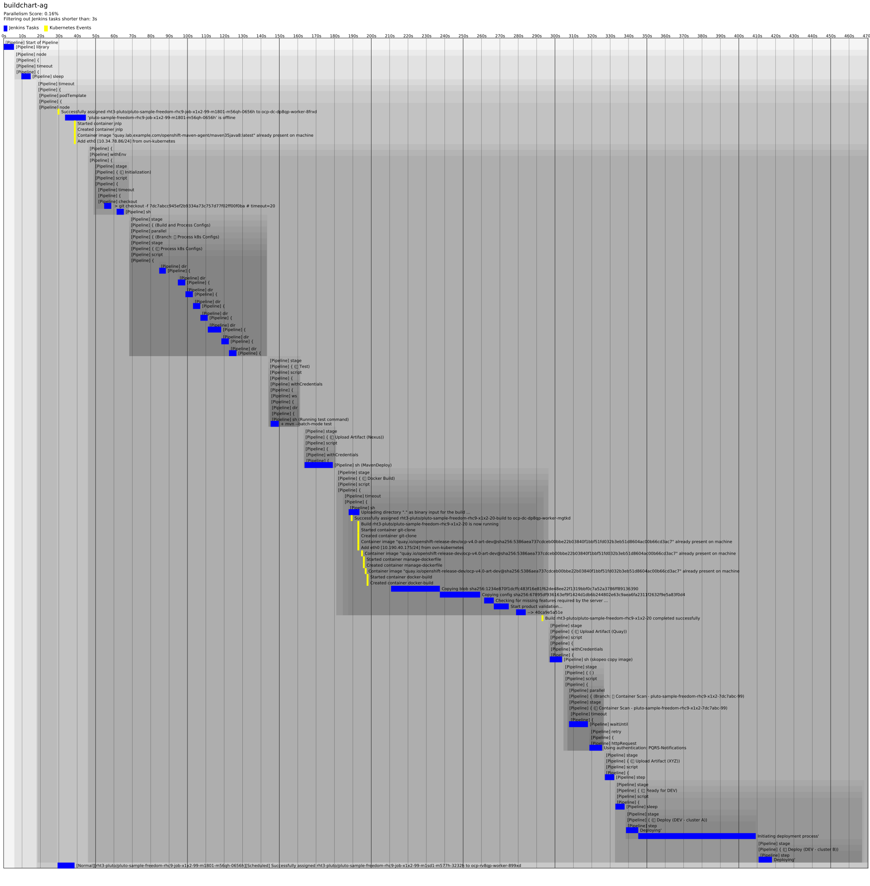

# buildchart-ag
Render interesting charts from CI/CD and infrastructure logs

Usage
-----

`buildchart-ag` is a command line tool for generating SVG images from
log files.  Currently, it expects Jenkins console log file output in
HTML form (saved directly from the Jenkins web UI).  The HTML logs are
required in order to properly thread parallel task output.  You can
also feed it kubernetes event logs, and buildchart-ag will attempt to
correlate the events with the logs visually.  Generate the event logs
like so: `kubectl get event -n NAMEPACE -o json`.

By default, `buildchart-ag` will not render any tasks that take less
than 3 seconds.  You can change this with the `--filter` option.
Using `--filter 0` will have `buildchart-ag` include everything.

Here is the default CLI output:
```
buildchart-ag - copyright (C) 2023 Anthony Green <green@redhat.com>

Usage: buildchart-ag [-v|--verbose] [-s|--scale SCALE] [-t|--timestamps]
                     [-f|--filter FILTER] logs-file [log-file]*

Available options:
  -v, --verbose            produce verbose output
  -s, --scale SCALE        scale multiplier (default: 10)
  -t, --timestamps         show timestamps
  -f, --filter FILTER      filter seconds (default: 3)

Distributed under the terms of the MIT license.
```

Requirements
------------
`buildchart-ag` has been tested on Linux with
[`sbcl`](https://www.sbcl.org/) and uses
[`ocicl`](https://github.com/ocicl/ocicl) for dependency management.
Run `ocicl install` to download dependencies, and `make` to build.

Sample Output
-------------
Here's sample output that shows kubernetes events overlayed on the
Jenkins events.  Note that the shaded rectangles represent nested
elements in Jenkins.  The darker the box, the deeper the nesting.
This makes it easy to quickly identify the section that you are
looking at.



This next example shows a visualization of parallel Jenkins tasks. In
every case you must feed `buildchart-ag` the full HTML console output
from the Jenkins web UI.  This example was built from
https://ci.jenkins.io/job/Core/job/jenkins/job/master/5558/consoleFull.
This also shows full timestamps enabled via the `-t` option.


Author
------

`buildchart-ag` was written by Anthony Green.

* email    : green@redhat.com
* linkedin : http://linkedin.com/in/green
* twitter  : [@antgreen](https://twitter.com/antgreen)
